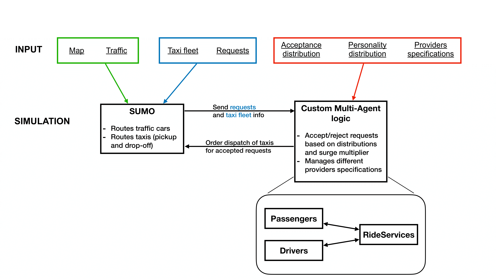
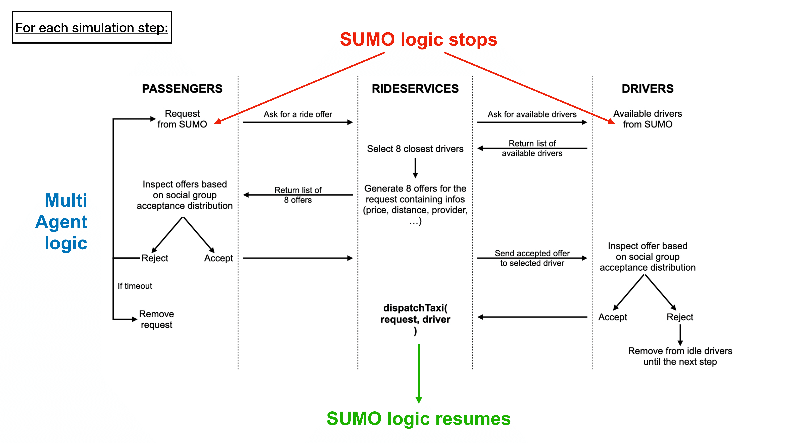

# San Francisco Ride-Hailing Digital Shadow

This replication package replicates the results of **A Multi-Agent Approach for Engineering Digital Twins of Smart Human-Centric Ecosystems**.

This replication package includes data and instructions on how to run, interpret and obtain the results presented in our work.

To clone this repository, you can download the folder in `.zip` format (~940 MB, 'Download Repository' button at the top-right of this page), and extract it.

## Structure

This replication package includes 8 folders, a *main.py*, a *clean.sh* script to clean `.env` file and output directories, and a *requirements.txt* file.

- `classes/`: contains simulation and multi-agent logic.
- `config/`: contains `.json` files to configurate parameters and scenarios.
- `paths/`: contains paths for better readability.
- `data/`: contains all raw input data for the digital shadow.
- `doc/`: contains additional documentation of the project. It also contains the list of the days with no traffic data available from [SFMTA](https://data.sfgov.org/Transportation/SFMTA-Transit-Vehicle-Location-History-2021-/9722-grnf/data_preview).
- `experiments/`: contains the notebooks and the results of the experiments.
- `libraries/`: contains all the utility functions to generate input and output of the simulation.
- `sumoenv/`: contains the folders with input and output files, the SF net file, and the template for the `sumocfg` file, which is automatically generated for each execution in *main.py*.

## How-to-run instructions

### Generating results

1. Open project (`cd/path/to/this/project`), create a virtual environment with Python >=3.10 (`python3.10 -m venv .venv`) and activate it (`source .venv/bin/activate`).
2. Install requirements from *requirements.txt* file (`pip install -r requirements.txt`).
3. Run python notebooks `.ipynb` in the `experiments/` folder to generate the results of the experiments for **RQ1-Responsiveness**, **RQ2-Fidelity**, **RQ3-Adaptability** and **RQ4-Robustness**. The results will be saved in the `experiments/results/` folder and printed in the notebooks.

### Running simulations

1. Install [*SUMO*](https://sumo.dlr.de/docs/Downloads.php) and set [*SUMO_HOME*](https://sumo.dlr.de/docs/Basics/Basic_Computer_Skills.html#sumo_home) environment variable. For MacOS users, prefer installation via **Homebrew**. To run the simulation with the GUI, install *SUMO* following the instructions [here](https://github.com/DLR-TS/homebrew-sumo), then run [*XQuartz*](https://www.xquartz.org/) in background (MacOS users).
2. Open project (`cd/path/to/this/project`), create a virtual environment with Python >=3.10 (`python3.10 -m venv .venv`) and activate it (`source .venv/bin/activate`).
3. If needed, change paths indicated in `paths/sumoenv.py`.
4. Install requirements from *requirements.txt* file (`pip install -r requirements.txt`).
5. Execute the Digital Shadow by simply running *main.py*.
6. Follow the instructions in the terminal to initialize the simulation:
    - **START_DATE**: the date of the first day of the simulation in the format `YYYY-MM-DD`.
    - **END_DATE**: the date of the last day of the simulation in the format `YYYY-MM-DD`.
    - **START_TIME**: the time of the first day of the simulation in the format `HH:MM`.
    - **END_TIME**: the time of the last day of the simulation in the format `HH:MM`.
    - **SCENARIO_NAME**: the name of the scenario to be created (e.g., `normal`, `underground_alarm`, `flash_mob`).
    - **MODE**: `sumo` to run the simulation with *SUMO* logic only, `multi-agent` to run the simulation with multi-agent logic, or `multi-agent-social-groups` to run the simulation with both multi-agent logic and acceptance probabilities of social groups.
    - **ACTIVE_GUI**: `True` to run the simulation with the *SUMO* GUI, `False` otherwise.
    - **VERBOSE**: `True` to print detailed information about the simulation, `False` otherwise.
    
    Options will be saved in the `.env` file in the root folder of the project. If you want to change the options, you can edit the `.env` file directly or run *main.py* again after deleting the `.env` file.
7. Inspect output folder `sumoenv/scenarios/{scenario_name}/{mode}/{timeslot}`. The final CSV metrics file will be saved as `sf_final_metrics.csv` and can be inspected with the `HTML` interactive line plot visualization `sf_final_metrics_visualization.html`.

#### Running simulations in batch

To run simulations in batch, you can use the `run.sh` bash script. This script will run the simulation for all the specified durations (both during 'day' shift and 'night' shift), modes and days. To change settings, simply modify the parameters list at the beginning of the script. **NOTE: Be sure to run the script from the project root folder to effectively load the `.env` file (i.e., `./experiments/run.sh` or `bash experiments/run.sh`).**

## How-to-extend instructions

The project is designed to be easily extensible and adaptable to different scenarios. The multi-agent model can be easily modified to include new features, without acting directly on the agents. The user can simply modify the `.json` files in the `config/` folder to change the parameters of the agents (such as different acceptance probability distribution) or add other components (such as other different ride-hailing providers). It is also possible to specify the zones of the city where some of the parameters apply, such as the traffic, ride requests, and driver availability.

### Parameters

The modifiable parameters of the simulation are defined in the `config/parameters_config.json` file.

These parameters include:
- `trigger_time`: the timestamp at which the new modified parameters will be applied during the simulation.
- `duration_time`: the duration (timestamps) of the event.
- `location`: the location of the event (can be `downtown`, `midtown`, or `all`), configurable for parameters which do not involve social groups.
- `requests_perc`: the percentage of ride requests to be generated during the event (can also specify zone).
- `drivers_perc`: the percentage of drivers to be generated during the event (can also specify zone).
- `traffic_perc`: the percentage of traffic to be generated during the event (can also specify zone).
- `rides_length`: the multiplication factor of the length of the rides during the event (can also specify zone).
- `slow_down_perc`: the percentage of speed reduction for traffic vehicles in the downtown area during the event (can also specify zone).
- `slow_mid_perc`: the percentage of speed reduction for traffic vehicles in the midtown area during the event (can also specify zone).
- `drivers_personality_distribution`: the probability distribution of drivers' personalities.
- `drivers_acceptance_distribution`: the probability distribution of drivers' acceptance of ride offers based on surge multiplier.
- `passengers_personality_distribution`: the probability distribution of passengers' personalities.
- `passengers_acceptance_distribution`: the probability distribution of passengers' acceptance of ride offers based on surge multiplier.
- `providers`: the list of ride-hailing providers available in the simulation, with their respective parameters (e.g., base fare, max surge multiplier, price per km, etc.).
- `drivers_stop_probability`: the cumulative probability of a driver stopping due to inactivity, which increases after each ride request rejection (e.g., if probability is 0.1, after 5 rejections the driver will stop with 50% probability).
- `timeouts`: the maximum waiting time for a ride request for both passengers and drivers, after which the request is removed from the simulation.

### Scenarios

The project includes a set of predefined disruptive scenarios indicated with intuitive code-names. These scenarios are defined in the `config/scenarios_config.json` file and can be easily modified or extended. When injecting a scenario, the system will automatically adjust the parameters of the simulation (in `config/parameters_config.json`) to reflect the scenario's characteristics. This includes modifying the traffic, ride requests, and driver availability according to the scenario's description.

The disruptive scenarios include:

- `Underground Alarm`: A 200% peak of requests and a 50% peak of traffic in the downtown area of the city.
- `Wildcat Strike`: A drop of drivers availability, implemented with a 50% decrease of drivers available in the zone.
- `Flash Mob`: A sudden decrease of speed in the midtown area of the city (-90% in downtown and -70% in the nearby zones).
- `Long Rides`: A sudden increase of the range of rides to 10 times the standard range (that is, 3 TAZs radius).
- `Greedy Drivers`: A sudden increase of ‘greedy drivers’ to 80%, who decline ride requests also with standard fares, when perceiving an increasing number of ride requests.
- `Boycott TNCs`: A boycott of Transportation Network Companies by passengers, resulting in a 50% decrease of passengers requests.
- `Budget Passengers`: A sudden increase of ‘budget passengers’ to 80%, who are more likely to reject ride offers and wait longer for a ride.

These are predefined scenarios, but you can easily add your own by modifying the `config/scenarios_config.json` file or even by directly modifying the `config/parameters_config.json` general file. The system will automatically detect the new scenario and run it accordingly.

## Classes

- `Simulator`: Creates the *SUMO* configuration and initializes the multi-agent model.
- `Model`: Initializes and computes steps for the agents while running the simulation.
- `Passengers`: Manages unassigned ride requests and interacts with the ride service to accept/reject offers from drivers.
- `Drivers`: Manages idle drivers and interacts with the ride service to accept/reject offers from passengers.
- `RideServices`: Manages ride offers and acceptances between passengers and drivers. When both passenger and driver accept the offer, the ride is dispatched.
- `Logger`: Handles logging of the simulation and multi-agent model, saving metrics and statistics in CSV files.

## Architecture

All the input files for the simulation are automatically generated in `main.py`. Input files include:
- `sf.net.xml`: *SUMO* network file (**map**) of San Francisco.
- `sf_routes_{starttime_endtime}.rou.xml`: *SUMO* routes file for the **traffic** of San Francisco. It contains the trip information for each traffic vehicle.
- `sf_tnc_fleet_{starttime_endtime}.rou.xml`: *SUMO* routes file for the **fleet** of TNC drivers of San Francisco. It contains the starting point, the time of departure and the end of the shift for each driver.
- `sf_tnc_passengers_{starttime_endtime}.rou.xml`: *SUMO* routes file for the **passengers** ride requests of San Francisco. It contains the time of request, the starting point and the destination for each passenger.

Additionally, `main.py` generates the *SUMO* configuration file `sumo_config.sumocfg`, which contains the simulation parameters and the input files to be used.

The simulation is then run with a real-time interaction between *SUMO* and the multi-agent model. The *SUMO* logic handles the traffic and the routing of all the vehicles, while the multi-agent model handles the ride-hailing services. The two components interact with each other through [*TraCI*](https://sumo.dlr.de/docs/TraCI.html).

### Multi-agent model

The multi-agent model is composed of three main components: `Passengers`, `Drivers` and `RideServices`. The logic of the multi-agent model is run every 60 timestamps by default, mirroring the behavior of the ride dispatching algorithm of SUMO. However, this parameter can be changed by setting the related option in `main.py`.

For each step of the multi-agent logic, *SUMO* logic stops. `Passengers` and `Drivers` are then updated with the current state of the simulation by interacting with *SUMO*. This includes the time of the simulation, the unassigned ride requests, and the drivers currently available. Then, for each request, the following actions are performed:
1. `Passengers` asks for a ride to `RideServices`, which forwards the request to `Drivers`.
2. `Drivers` receives the ride request and returns the list of available drivers to `RideServices`.
3. `RideServices` receives the list of available drivers and selects the 8 closest drivers to the passenger. Then, it generates a ride offer for each driver, containing information about the ride (e.g., time, distance, price, etc.) and sends these 8 offers to `Passengers`.
4. `Passengers` receives the ride offers and selects the best one according to the acceptance probability distribution of the social group the passenger belongs to. 
    - If the passenger rejects all the offers, the request is marked as rejected. If the request has exceeded the maximum waiting time, the passenger is removed from the simulation, otherwise the request is kept in the list of unassigned requests. 
    - If the passenger accepts an offer, `Passengers` notifies `RideServices`, which forwards the acceptance to `Drivers`.
5. `Drivers` receives the accepted offer and accepts/rejects it according to the acceptance probability distribution of the social group the driver belongs to.
    - If the driver rejects the offer, the request is rejected and the driver is marked as unavailable until the next step of the multi-agent logic. The request is kept in the list of unassigned requests. After 30 minutes, each request rejection increases a driver's probability of stopping due to inactivity by 10%.
    - If the driver accepts the offer, `Drivers` notifies `RideServices`, which finally dispatches the ride using the *TraCI* method `dispatchTaxi(request_id, driver_id)`.

When all the requests are processed, the *SUMO* logic is resumed, until the next step of the multi-agent logic.